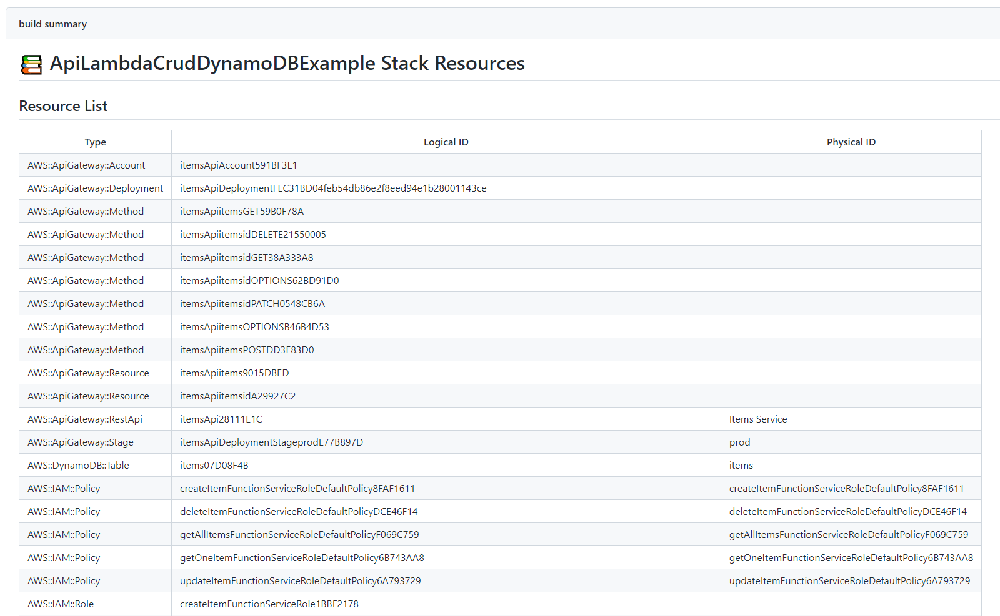
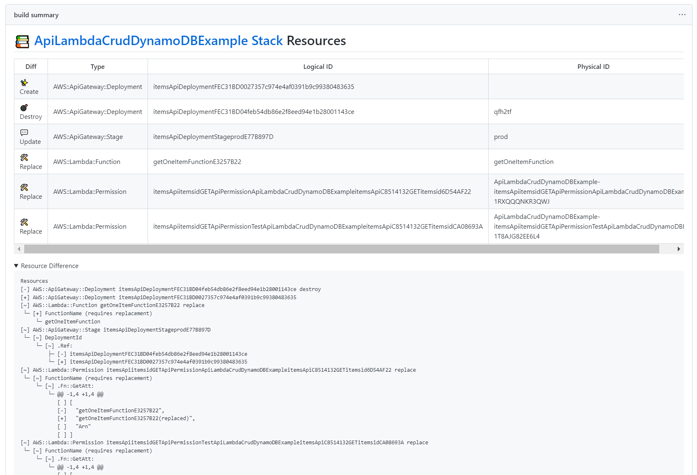
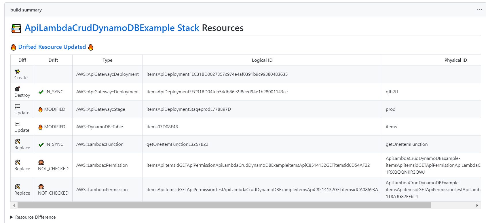

# actions-cfn-diff

This GitHub Actions outputs a Job Summary listing the resources included in the CloudFormation template.

## Precondition

- use [aws-actions/configure-aws-credentials@v2](https://github.com/aws-actions/configure-aws-credentials)
- setup IAM Role for describe Cloudformation stacks

The IAM policy required by this action is as follows

```
{
    "Version": "2012-10-17",
    "Statement": [
        {
            "Effect": "Allow",
            "Action": [
                "cloudformation:ListStacks",
                "cloudformation:DetectStackDrift",
                "cloudformation:DetectStackResourceDrift",
                "cloudformation:DescribeStackDriftDetectionStatus",
                "cloudformation:GetTemplate",
                "cloudformation:ListStackResources"
            ],
            "Resource": "*"
        }
    ]
}
```

## Usage Example

```
on:
  pull_request:

name: Build on PullRequest

permissions:
  id-token: write
  contents: read
  pull-requests: write

jobs:
  build:
    runs-on: ubuntu-latest
    steps:
      - uses: actions/checkout@v3
      - uses: actions/setup-node@v3
        with:
          node-version: 14
      - name: Configure AWS credentials
        uses: aws-actions/configure-aws-credentials@v2
        with:
          aws-region: ap-northeast-1
          role-to-assume: arn:aws:iam::0000000:role/deploy_from_github
      - name: Set up AWS CDK
        run: npm install -g aws-cdk
      - name: Make Cloudformation Templates
        run: cdk synth
      - uses: taichi/actions-cfn-diff@v1
        with:
          aws-region: ap-northeast-1
```

See [action.yml](action.yml) for the full documentation for this action's inputs
and outputs.

## Report Examples

### [Before deploy](https://github.com/taichi/actions-cfn-diff-example/actions/runs/4392834414)



### [Resource update summary](https://github.com/taichi/actions-cfn-diff-example/actions/runs/4394981752)



### [Resource update summary with drift](https://github.com/taichi/actions-cfn-diff-example/actions/runs/4395427399)



## Related Tools

- [CDK diff commenter Action](https://github.com/tsuba3/cdk_plan_action)
- [cdk-notifier](https://github.com/karlderkaefer/cdk-notifier)
